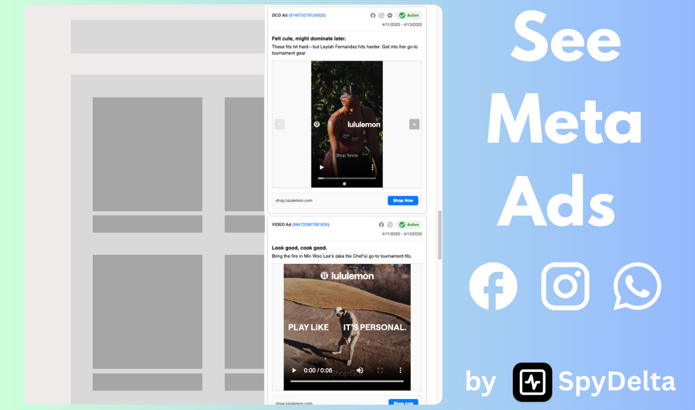
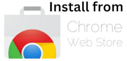
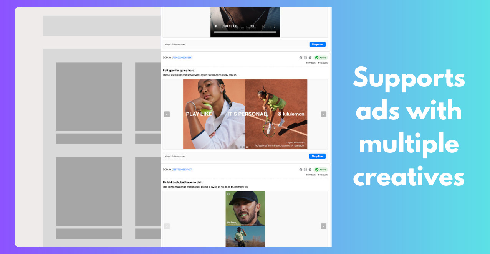
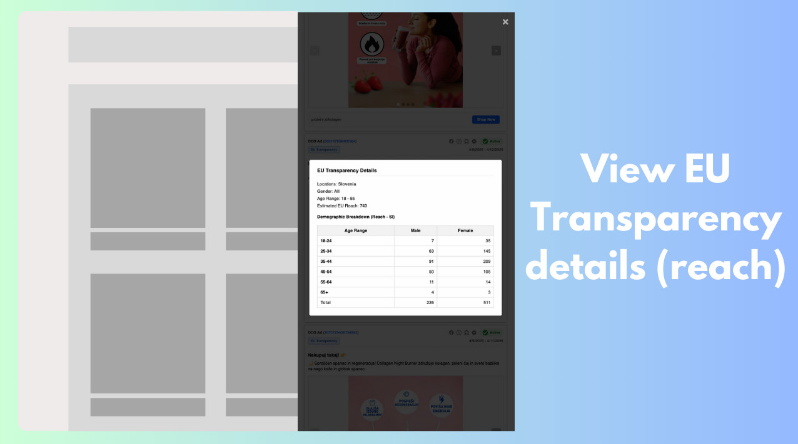
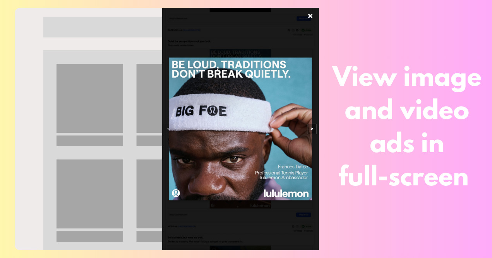

# Meta Ad Library Viewer

This browser extension allows you to view Meta Ads of a brand directly from their website. Stop wasting time navigating the Meta Ad Library.

## Privacy

This extension **only communicates with Meta Ad Library API** and does not communicate with any other server whatsoever. We do not track/collect any data from you.

## Install

## How it works

1. Extension tries to find link to Brand's Facebook page on the website
2. If it finds one, extension icon will turn green
3. When you click on the icon, extension will fetch ads from Meta Ad Library and display them in a sidepanel
4. User can view ads, both video and image creatives. User can swipe through them, and filter by either active/inactive ads.

## Features

### Multiple creatives per Ad

Some ads have multiple creatives (videos/images) - carousel ads, DCO (dynamic creative optimization) ads, DPA (dynamic product ads), and multi-creative ads. This tool allows you to easily swipe through them.

### EU Transparency Details

This tool allows you to view the EU Transparency details of the Ad.

### View Ads in full-screen

You can view ad creatives, both video and image, in full-screen mode when you click on them.

